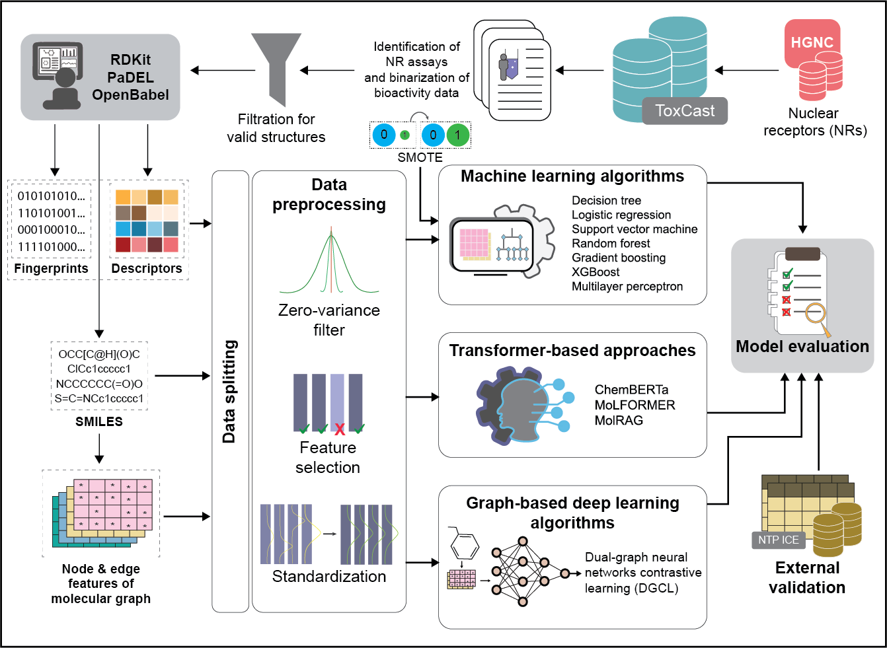

# Benchmarking AI Models for Predicting Nuclear Receptor Activity from Tox21 Assays

## Contributors

- [Nikhil Chivukula](https://github.com/NikC99)
- [Jaisubasri Karthikeyan](https://github.com/jaisubasri)
- [Harshini Thangavel](https://github.com/HARSHINITHANGAVEL)
- [Shreyes Rajan Madgaonkar](https://github.com/mshreyes)

## Reference

This repository is associated with the manuscript:  
Nikhil Chivukula<sup>#</sup>, Jaisubasri Karthikeyan<sup>#</sup>, Harshini Thangavel<sup>#</sup>, Shreyes Rajan Madgaonkar<sup>#</sup>, and Areejit Samal\*,  
*[Benchmarking Artificial Intelligence Models for Predicting Nuclear Receptor Activity from Tox21 Assays]( https://doi.org/10.64898/2026.03.20.713297)*, bioRxiv, 2026.03.20.713297 (2026).
(\* Corresponding author: [asamal@imsc.res.in](mailto:asamal@imsc.res.in))  
(<sup>#</sup> Joint-First authors)

## Overview

Nuclear receptors (NRs) are primary targets of endocrine disrupting chemicals (EDCs). In this study, a systematic comparative analysis was conducted across diverse AI models — classical machine learning (ML), graph-based deep learning (DL), and transformer-based large language models (LLMs) — combined with multiple chemical feature spaces including fingerprints, molecular descriptors, and SMILES, to benchmark their predictive utility for nuclear receptor activity classification. Bioactivity data for 18 NRs was sourced from the Tox21 assays from [ToxCast invitrodb v4.3](https://doi.org/10.23645/epacomptox.6062623), and models were externally validated against the [NTP ICE datasets](https://ice.ntp.niehs.nih.gov/DATASETDESCRIPTION?section=Endocrine).



This repository contains 3 top-level folders described below.

---

## 1. [code](./code/)

This folder contains all scripts for model training and evaluation, organized by model family.

### 1.1 [machine_learning](./code/machine_learning/)
Scripts for training and evaluating seven classical ML classifiers, namely, Logistic Regression (LR), Decision Tree (DT), Random Forest (RF), Gradient Boosting (GBT), XGBoost (GBT), Support Vector Machine (SVM), and Multilayer Perceptron (MLP), across three chemical feature spaces: molecular descriptors, fingerprints, and their combination. Includes preprocessing pipelines with zero-variance filtering, Boruta feature selection, standardization, and SMOTE for class imbalance.

### 1.2 [dgcl_deep_learning](./code/dgcl_deep_learning/)
Scripts for the Dual-Graph Contrastive Learning (DGCL) model, a self-supervised GNN architecture using Graph Attention Network (GAT) and Graph Isomorphism Network (GIN). Molecular graph representations (node and edge features) are derived from SMILES using RDKit and processed via PyTorch Geometric.

### 1.3 [chembert_a](./code/chembert_a/)
Fine-tuning scripts for ChemBERTa, an encoder-based transformer pretrained on SMILES from the ZINC database using masked language modeling. SMILES inputs are tokenized into 128-bit vectors and trained using a combined focal loss and cross-entropy objective.

### 1.4 [molformer](./code/molformer/)
Scripts for MoLFORMER, a large-scale transformer trained on over 1.1 billion molecules from PubChem and ZINC. SMILES inputs are tokenized into 256-bit vectors. Uses the same weighted training objective as ChemBERTa.

### 1.5 [molrag_llama_3.1](./code/molrag_llama_3.1/)
Scripts for MolRAG, which integrates retrieval-augmented generation (RAG) and chain-of-thought reasoning using Llama 3.1-8B Instruct as the base LLM. For each query molecule, structurally similar reference molecules are retrieved from the training set based on Tanimoto similarity, and a molecule-specific prompt is constructed with assay context, query SMILES, descriptors, and neighbor annotations.

---

## 2. [data](./data/)

This folder contains all datasets used in the study, organized as described below.

### 2.1 [Features](./data/Features/)
Master feature files for all 8430 chemicals curated from ToxCast invitrodb v4.3. These are shared across all receptors and activities.

| File | Description |
|------|-------------|
| `ECFP4_8430_chemicals.csv.7z` | Morgan fingerprints without features (radius=2, 1024-bit) |
| `FCFP4_8430_chemicals.csv.7z` | Morgan fingerprints with features (radius=2, 1024-bit) |
| `Layered_8430_chemicals.csv.7z` | Layered fingerprints (2048-bit) |
| `MACCS_8430_chemicals.csv.7z` | MACCS keys (167-bit) |
| `PaDEL_2D_and_3D_8430_chemicals.csv.7z` | 1875 PaDEL 2D and 3D molecular descriptors |
| `RDKit_2D_and_3D_8430_chemicals.csv.7z` | 231 RDKit 2D and 3D molecular descriptors |
| `SMILES_8430_chemicals.csv.7z` | Canonical SMILES from Open Babel |

### 2.2 Receptor activity folders ([AHR](./data/AHR/), [AR](./data/AR/), [CAR](./data/CAR/), [ERa](./data//ERa/), [ERb](./data/ERb/), [ESRRA](./data/ESRRA/), [FXR](./data/FXR/), [GR](./data/GR/), [PPARd](./data/PPARd/), [PPARg](./data/PPARg/), [PR](./data/PR/), [PXR](./data/PXR/), [RARA](./data/RARA/), [RORC](./data/RORC/), [RXRA](./data/RXRA/), [THRA/THRB](./data/THRA_THRB/), [VDR](./data/VDR/))
One folder per receptor, each containing up to three activity subfolders — `agonist`, `antagonist`, and `combined`. Each activity subfolder contains 4 split index files that record chemical IDs, activity labels (0=inactive, 1=active), and train/test/val assignments across 3 random data splits. These files are designed to be merged with the master feature files in [`Features/`](./data/Features/) to reconstruct training and test sets. Refer to [`data/README.md`](./data/README.md) for detailed usage instructions.

| File | Feature type |
|------|-------------|
| `descriptor_split_index.csv` | PaDEL and RDKit descriptors |
| `descriptor_fingerprint_split_index.csv` | Descriptors + fingerprints combined |
| `fingerprint_split_index.csv` | ECFP4 / FCFP4 / Layered / MACCS |
| `smiles_split_index.csv` | SMILES (includes train/test/val) |

### 2.3 [DA_index](./data/DA_index/)
Applicability domain index files (Delta, Gamma, Kappa values) for all model-feature combinations, organized by receptor and activity. These are used to assess the reliability of model predictions by identifying chemicals within and outside the model's domain of applicability.

---

## 3. [external_data](./external_data/)

This folder contains the external validation datasets obtained from the [NTP Integrated Chemical Environment (ICE) dataset](https://ice.ntp.niehs.nih.gov/DATASETDESCRIPTION?section=Endocrine) for AR, ERa, and ERb receptors, including both *in vivo* and *in vitro* bioactivity data for agonist and antagonist activities. Chemicals overlapping with the training data were excluded prior to validation.

---

## Requirements

```bash
pip install -r requirements.txt
```

---

## Citation

If you use the code or data in this repository, please cite the following manuscript:  
Nikhil Chivukula, Jaisubasri Karthikeyan, Harshini Thangavel, Shreyes Rajan Madgaonkar, and Areejit Samal,  
*[Benchmarking Artificial Intelligence Models for Predicting Nuclear Receptor Activity from Tox21 Assays]( https://doi.org/10.64898/2026.03.20.713297)*, bioRxiv, 2026.03.20.713297 (2026).
